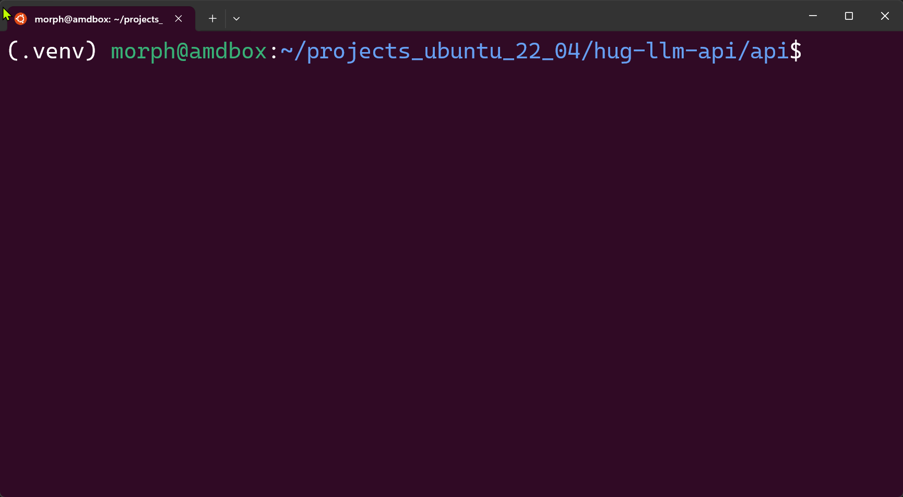

# LLM Backend API

Репозиторий содержит код необходимый для развёртывания *бэкенда сервиса заметок* (само веб-приложение находится 👉 [тут](https://github.com/Kridalll/SteroidnotesFront) `[WIP]`), предоставляет доступ к функциональности связанной с нейронными сетями в форме REST API.

- Python примеры запуска моделей в облаке, RAG построенный на [`streamlit`](https://docs.streamlit.io/) в [отдельной ветке](https://github.com/imanchoys/hug-llm-api/tree/langch-for-pdf/talk-with-pdf)
- предоставляет возможность запустить LLM локально или же в облаке
- реализация API (FastAPI) для некоторых моделей: `Saiga-Mistral-7b`, `Kandinsky 2`, `mbart-ru-gazeta`


Библиотеки необходимые для сборки **основного проекта** указаны в файле: [`api/requirements.txt`](https://github.com/imanchoys/hug-llm-api/tree/main/api/requirements.txt)

```config
auto_gptq==0.5.1
autollm==0.0.22
chromadb==0.4.18
chromadb==0.4.17
ctransformers==0.2.27
diffusers==0.23.0
fastapi==0.109.0
gradio==4.14.0
huggingface_hub==0.19.4
langchain==0.1.1
loguru==0.7.2
modal==0.55.4091
peft==0.6.1
Pillow==10.2.0
rich==13.7.0
torch==2.1.0
transformers==4.35.2
llama-cpp-python==0.2.24
```

## Локальная сборка проекта

> Python версия (>=): **3.11**

- создание виртуального окружения:
  
  ```bash
  pyenv local 3.11.5
  python -m venv .venv
  ```

- установка библиотек через `pip`:
  
  ```bash
  pip install -r api/requirements.txt
  ```

- при локальном развёртывании, файл модели нейронной сети будет скачиваться с [huggingface](https://huggingface.co/) и может занимать <u>значительный</u> объём на диске (~2-10 GB)

- запуск API [Saiga Mistral 7b GGUF](https://huggingface.co/IlyaGusev/saiga_mistral_7b_lora):

    ```bash
    python api/local_saiga_mistral_7b_gguf_fastapi.py
    ```

## Удалённый запуск сервиса через облако Modal

Сервис [*Modal*](modal.com) обеспечивает возможность развёртывания API вместе с фронтендом на их домене, используя облачные GPU.

Чтобы пользоваться функциями обл. провайдера modal нужно авторизоваться в аккаунте с помощью CLI, которое предварительно устанавливается:

```bash
pip install modal # установка и библиотеки и CLI
python3 -m modal setup # открывает браузер для входа в аккаунт, затем локально будет сохранён токен авторизации
```

Чтобы отправить какую-либо (в данном примере [Kandinsky 2.2](https://huggingface.co/kandinsky-community/kandinsky-2-2-prior)) нейросеть работать (как сервис и API) в modal-облако выполняем:

```bash
modal deploy api/modal_kandinsky_2_2.py 
```

> - Примечание, для работы некоторых сервисов **может быть** нужен файл (`api/frontend/index.html`) с простым html фронтендом, в том случае если сервис подразумевает UI.
> - Modal использует [containerd](https://github.com/containerd/containerd) для удалённой сборки окружения ➡️ не всегда всё собирается с первого раза, возможно нужно будет заменить версии библиотек путём изменения [кода отв. за это](https://modal.com/docs/guide/custom-container)

### Пример работы сервиса в облаке


## Пример работы с Saiga-Mistral локально


